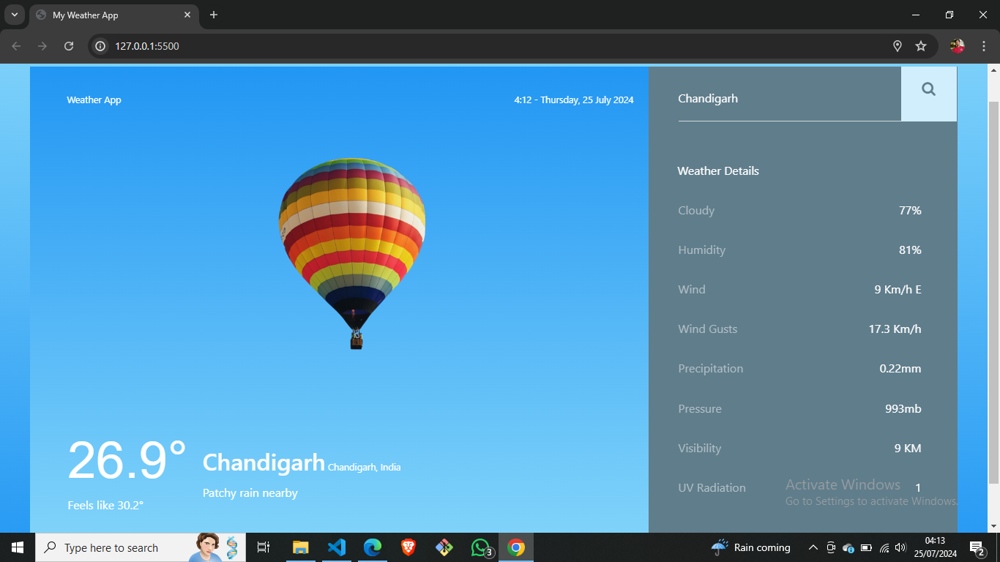

# Weather App

This is a simple weather application that fetches current weather information based on geolocation or user input.

## Live Website
Link- https://shanuchoudhary84.github.io/Weather-App/

## Features

- Fetches weather data using OpenWeatherMap and WeatherAPI.
- Supports geolocation-based weather retrieval.
- Allows manual location search.
- Displays current temperature, feels like temperature, humidity, wind speed, and other weather metrics.

## Technologies Used

- HTML, CSS, JavaScript
- Fetch API for making HTTP requests
- OpenWeatherMap API for weather data
- WeatherAPI for weather data

## Setup

To run this project locally, follow these steps:

1. Clone the repository:
   ```bash
   git clone https://github.com/your-username/weather-app.git
   cd weather-app
2.Open index.html in your web browser.

3.Allow geolocation access when prompted, or manually enter a location in the search box.

Enjoy the weather updates!

## APIs Used
1.OpenWeatherMap API
2.WeatherAPI

## Screenshots




## License
This project is licensed under the MIT License - see the LICENSE file for details.
